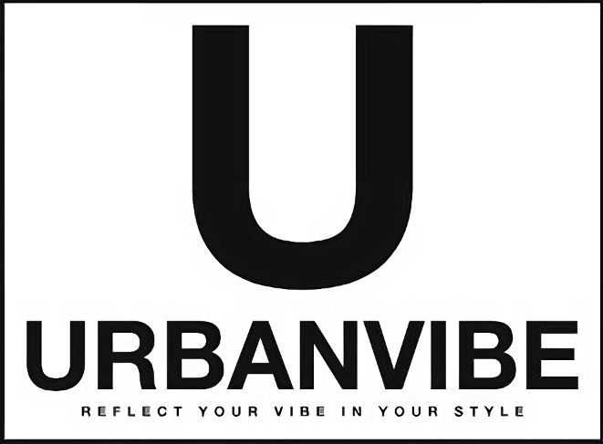
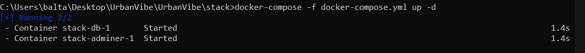
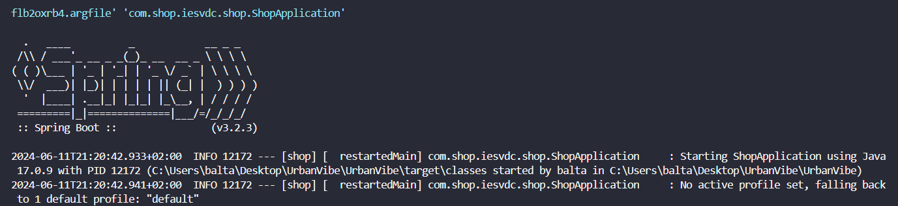

# Índice

* Introducción
  * Datos del proyecto
  * Planificación
  * Ejecución del proyecto
  * Organización del proyecto
* Tecnologías
* Analisis de Diagramas
  * Diagrama clases
  * Diagrama de la base de datos
  * Diagrama de ayuda para la lógica
* Implementación
* Conclusiones
  * Experiencias personales y pequeñas explicaciones
* Bibliografía y Webgrafía   

\pagebreak
\newpage

## Introducción

El proyecto consiste en una página de ropa urbana que es lo que más a día de hoy está de moda,donde hay ropa tanto de mujer como de hombre,y todo diseñado a mano desde 0 con varias ideas proyectadas en mi cabeza y sobre todo con muchas ganas y dedicación y horas de trabajo en una de las etapas más duras que he vivido,y estoy muy contento de haber conseguido lo que he conseguido con este proyecto a pesar de las adversidades.

Este proyecto surgió de una idea propia la cúal a mi siempre me ha gustado que es la de crear yo mi propia tienda de ropa con los productos que yo mismo he diseñado y poder hacer una venta de lo mismos.

Otra de las principales ideas del proyecto sería una vez finalizado si es posible poder llegar a vender el software a alguna empresa que esté a punto de empezar en este mundo y necesite una tienda virtual, como digo es una idea ya luego al final hay que pulir muchas cosas y muchos detalles.

El logo de la tienda principalmente es el siguiente:

Si nos ponemos a analizar el logo podemos ver como la U hace referencia a una asa de una bolsa o esa es la intención que la U simule lo que es una asa de una bolsa y debajo podemos ver el nombre de la empresa junto a su eslogan,principalmente este sería el diseño que llevarían las bolsas.


## Datos del proyecto

| Nombre | Apellidos | Título | Ciclo | Año | Centro educativo |
| --- | --- | --- | --- | --- | --- |
| Balbino | Moyano López | Desarrollo de Aplicaciones Multimedia | Superior | 2024 | IES Virgen del Carmen |


## Planificación

Esta sería aproximadamente la planificación del proyecto:

* 1º Semana 
  * En la primera semana de trabajo he esquematizado todo el proyecto,he buscado otras ideas de proyecto,además de hacer un diagrama UML de lo que a mi me gustaría que fuera finalmente este proyecto.
  * He dedicidido hacer el proyecto en spring debido a que he notado un importante interés en esta tecnología por las empresas que actualmente buscan desarrolladores de este estilo.
  * Esta estapa fue indispensable para crear unas buenas bases para el proyecto(UrbanVibe),el haber hecho los diagramas y haberlo esquematizado todo me ha ayudado muchisimo en la elaboración del proyecto porque gracias a todos estos recursos he podido entender mejor como iban a interecatuar las clases entre si y lo que yo iba a necesitar para hacer que todo funcionara correctamente.
* 2º Semana 
  * He intentado profundizar en una planificación detallada en  del proyecto,definiendo tareas y una serie de objetivos intentando que sean unos plazos realistas como sería por ejemplo objetivos semanales
  * También intenté hacerme un boceto de la estructura que iba a tener la base de datos para así tener una idea más clara de como se iba a almacenar y organizar la información de dicho proyecto.
  * He estado investigando páginas similares:Pull&Bear,Bershka,Zara,Mango...
  * 
* 3º Semana
  * He estado investigando más estilos para mi futura página de ropa además de estar mirando la posibilidad de añadir un bot en python para simular un atención al cliente
  * He estado estudiando diferentes maneras de contactarme con el usuario con el rol cliente como por ejemplo mensajería via gmail,etc...
* 4º Semana 
  * He decidio hacer el proyecto con Spring-MVC por que lo veo a pesar de haber estado debatiendo entre hacer Spring de backend y usar React en el frontend,se me sugirío hacerlo entero con Spring y en un futuro ya usaré React para el frontend.
  * Al no usar react uso mucho javascript para algunos estilos como por ejemplo el de la página principal del endpoint "/clothes" que voy pasando cada x tiempo una foto distinta
* 5º Semana 
  * Estoy terminando el backend y realizando varios ajustes en cuanto al frontend para hacerlo más visual e intuitivo.
  * Todos estos ajustes los realizo porque me he tirado muchas pero muchísimas horas buscando en distintas páginas de ropa para ir copiando estilos de una y de otra porque pienso que es lo más estético y lo que más llama la atención incluso lo que más fácil puede llegar a ser para el usuario.
* 6º Semana 
  * Primera versión demo semifuncional
  * Primera revisión de la documentación para ver que estén todos los puntos necesarios.
  * En la primera versión semifuncional,se puede hacer un pedido correctamente además de ver de forma detalla la ropa,controlo varias excepciones como por ejemplo sino se selecciona una talla que te ponga;"Por favor selecciona una talla"
  * Además también controlo varios errores de login y registro  y de manera visual se lo enseño al cliente
* 7º Semana
  * Resultados finales (proyecto terminado: tutorial, aplicación…) 
  * Segunda revisión del documento donde ya estén todos los apartados necesarios 
  * Preparación de la presentación 
  * Preparando javadoc y toda la documentación adicional del proyecto además de videos explicativos etc...
* 8º Semana 
  * Pulimos los posibles “bugs”
  * Correción de algunos códigos poco legibles también he intentado afinar un poco el código para que sea lo menos posible código denominado "spaguetti"
  * Entrega del documento final 
* 9º Semana   
  * Organización de la presentación
  * Entrega de la presentación para la exposición 
* 10º Semana  
  * Presentación del proyecto

## Ejecución del proyecto
Para ejecutar el proyecto realizado en spring primeramente necesitaremos haber montado previamente docker y haberlo ejecutado,para ello deberiamos de irnos a la carpeta donde se aloja nuestro docker-compose.yml y deberemos de ejecutar el siguiente comando:
```docker
docker-compose -f nombre_del_archivo.yml up -d
```
Si ya tenemos el docker creado de antes nos aparecerá esto:


En cambio si es la primera vez que lo hacemos tendremos esto:


Con este comando se nos ejecutará en los puertos que nosotros tengamos predefinidos en el archivo.yml el adminer,es decir, nuestra gestor de la base datos,para ver nuestra base de datos en ejecución entonces necesitaremos ejecutar spring que para ello podemos hacerlo de varias maneras,o desde visual studio con la extensión de spring que hay un botón de ejecutar o directamente con el comando:
```spring
mvn spring-boot:run
```
Una vez ejecutemos el comando esto:


Ejecutaremos el proyecto en el puerto por defecto que usa spring el 8080,si quisieramos cambiar el puerto por defecto de spring,lo deberemos de hacer en el archivo aplication.properties y poner algo talque así:
```application.properties
server.port=7070
```
He puesto el puerto 7070,pero se podría poner otro sin problemas siempre y cuando no esté ocupado


## Organización del proyecto
La organización del proyecto está compuesta por las siguientes carpetas:
- docs: aquí se alojan todas las fotos o documentos de interés que necesitemos.
- src:
  - main:
    - conf:aquí se alojan todo tipo de configuraciones relacionadas con la seguridad,login,register....
    - controller:aquí se alojan todo tipo de controladores con el que manejamos su crud completo de nuestras clases modelo
    - model: nuestras clases entidad y las que le dan sentido al proyecto
    - repo: se alojan todas las interfaces necesarias 
    - service: aquí pondremos si fuera necesario los servicios de nuestras clases modelo
    - ShopApplication.java: Es el archivo principal de nuestro proyecto, sin él,no ejecutaría
  - resources: se encuentra el codigo de basicamente todo el frontend que uso:
    - static: aquí se encuentra todas las imagenes,etc.
    - application.properties: se encuentran las contraseñas necesarias para que se conecte con la base de datos,no se debería de subir a git por motivos obvios.
    - import.sql: se encuentra todos los insert si queremos añadir algun dato en alguna tabla directamente en la base de datos.
    - templates: aquí se encuentran todas las plantillas.
      - users: en el encontramos los archivos:
        - users.html: muestra todos los usuarios,si tienes los requisitos suficientes para verlos(Admin),además de poder borrar y editar los usuarios.
        - add.html: muestra el formulario para añadir un usuario,si tienes los requisitos suficientes para verlos(Admin).
        - edit.html: muestra el formulario para editar un usuario,si tienes los requisitos suficientes para verlos(Admin).
      - help.html: al igual que acerca,es totalmente estético.
      - denegado.html: es un archivo el cual indica a un usuario sino tiene permisos pues lo redirigimos a la siguiente página.
      - menu.html:es el principal endpoint al cuál se le redirige a un usuario que tiene el rol Customer en el cual el usuario puede elegir que tipo de ropa quiere ver,si la de hombre,mujer o toda la ropa.
      - error.html: en caso de que exista algún tipo de error en nuestra página lo redirigimos a está que resulta más cómodo para el cliente ver que hay un error y que tiene que contactar con soporte.
      - index.html: es la página a la que redirigimos por defecto una vez hecho el login.
      - login.html: es la página por defecto de nuestro login.
      - signup.html: es la página para hacer un registro.
- stack: aquí se encuentran los archivos:
  - docker-compose.yml: este archivo es nuestro contenedor y dentro montamos las imagenes que necesitamos y el motor de base de datos que usamos
  - .env: aquí encontramos las contraseñas de nuestro docker-compose
  - setup.sql: es un archivo que sirve para inicializar la base de datos con el nombre que nosotros queramos ponerle a nuestra base de datos.
- pom.xml: es nuestro archivo de dependecias,sin él, el proyecto sería inservible

\pagebreak

