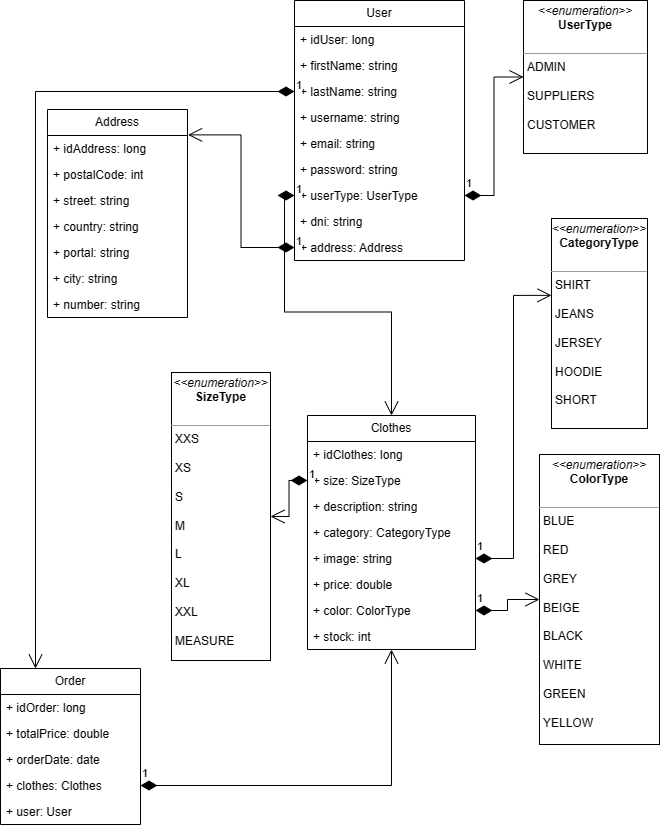
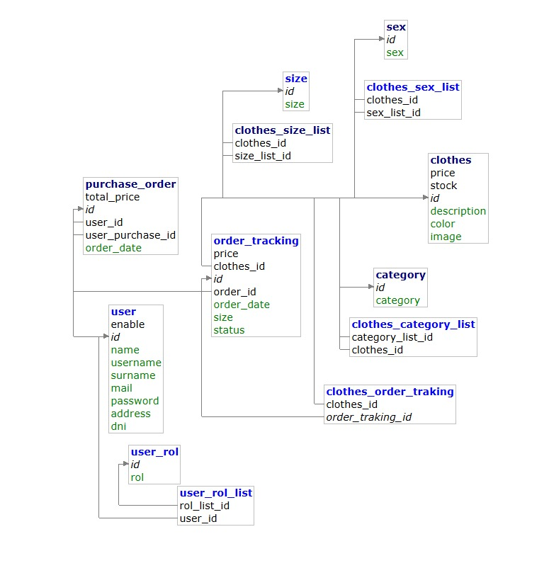
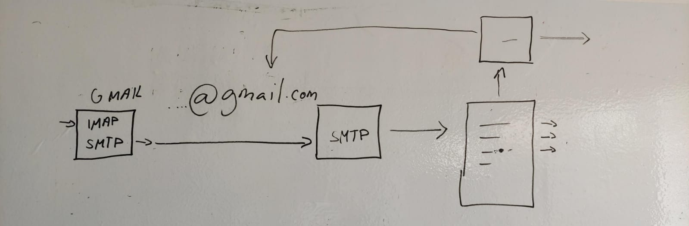

# Análisis

**Diagrama de mi aplicación para la tienda UrbanVibe.**

En este diagrama podemos ver las relaciones que he usado,aunque finalmente he cambiado varias cosas por ejemplo el color no es un enum sino que es un String y por ejemplo también uso una entidad adicional la cual se llama OrderTracking que tiene de relación:
* PurchaseOrder: 1 pedido tiene varias lineas de pedido la cual contiene mucha ropa.
* Clothes: 1 prenda de ropa puede estar en muchos pedidos.

Gracias a esta relación puedo ver la ropa que tiene cada pedido en el backend tal y como enseño en los videos.

______________________
**Esquema de la base de datos.**

Aquí muestro mi esquema de la base de datos donde podemos ver todos los id y relaciones de cada una de las tablas que conforman la tienda de ropa de UrbanVibe

______________________
**Esquema que me ha ayudado a realizar la lógica de gmail.**

Este es el principal esquema que me ha ayudado a realizar la lógica de mandar un email,que he explico más detalladamente en el siguiente apartado de implementación

\pagebreak
