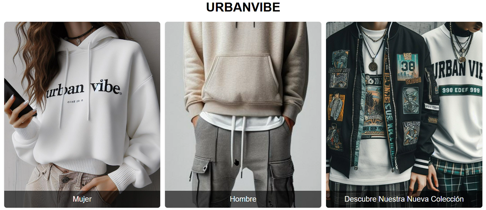

# Conclusiones
La conclusiones que he sacado con este proyecto son:
- 1º : A pesar del poco tiempo que he tenido lo he podido sacar adelante y he ido sacando todos los problemas que me han ido surgiendo y eso hace que esté realmente orgulloso de lo que he conseguido,aprendido y lo que he disfrutado haciendo el proyeto y poco a poco viendo avances del mismo
- 2º : Con tiempo dedicación y sobre todo sabiendo buscar y el dónde se pueden sacar muchas cosas que yo pensaba que no iba a poder llegar a sacar pero al fin y al cabo todo son horas y dedicación,todo este proyecto tiene mas de 50h ya que no me han pesado hecharle las horas porque me gusta programar,es algo que me tranquiliza(depende del momento) y que a veces cuando salen las cosas suele ser muy gratificante la verdad.

## Experiencias personales y pequeñas explicaciones
En cuanto a experiencias personales,aquí voy a explicar como he desarrollado en su mayoría cada una de las interfaces;
* menu.html: principalmente esta interfaz me gustó mucho de una de las interfaces que tiene el berhska en la cual se componen de un div con 3 imagenes muy reprensentativas de lo que te puedes llegar a encontrar cuando tu pinchas en ellas,la principal diferencia por ejemplo entre berhska y urbanvibe sería que los textos que ellos tienen como "Hombre","Mujer",etc... 

    Tal que así:
    

    Y UrbanVibe tiene los textos de esta otra manera:
    

    Además de implementarle un efecto que cada vez que está el ratón por encima de ampliación de la imagen.

