# Conclusiones
La conclusiones que he sacado con este proyecto son:
- 1º : A pesar del poco tiempo que he tenido lo he podido sacar adelante y he ido sacando todos los problemas que me han ido surgiendo y eso hace que esté realmente orgulloso de lo que he conseguido,aprendido y lo que he disfrutado haciendo el proyeto y poco a poco viendo avances del mismo
- 2º : Con tiempo dedicación y sobre todo sabiendo buscar y el dónde se pueden sacar muchas cosas que yo pensaba que no iba a poder llegar a sacar pero al fin y al cabo todo son horas y dedicación,todo este proyecto tiene mas de 50h ya que no me han pesado hecharle las horas porque me gusta programar,es algo que me tranquiliza(depende del momento) y que a veces cuando salen las cosas suele ser muy gratificante la verdad.

## Experiencias personales y pequeñas explicaciones
En cuanto a experiencias personales,aquí voy a explicar como he desarrollado en su mayoría cada una de las interfaces;
* menu.html: principalmente esta interfaz me gustó mucho de una de las interfaces que tiene el berhska en la cual se componen de un div con 3 imagenes muy reprensentativas de lo que te puedes llegar a encontrar cuando tu pinchas en ellas,la principal diferencia por ejemplo entre berhska y urbanvibe sería que los textos que ellos tienen como "Hombre","Mujer",etc... 

    Tal que así:
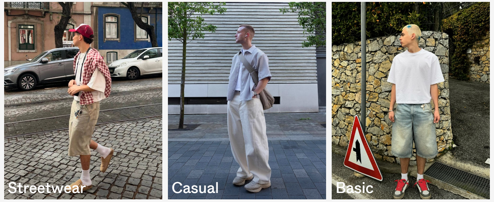

    Y UrbanVibe tiene los textos de esta otra manera:
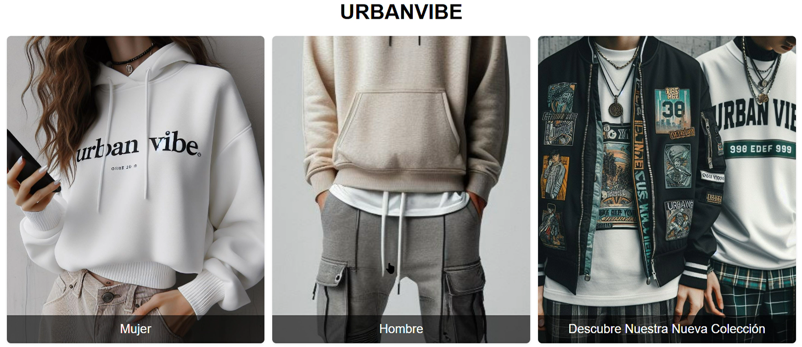

    Además de implementarle un efecto que cada vez que está el ratón por encima de ampliación de la imagen.

* clothes.html: en este archibo la principal idea era hacer un menu lateral a la izuierda con un buscado a la derecha y un banner en el top de la página,que finalmente no ha sido así porque vi la página de mango y lo vi algo muy sencillo intuitivo y sobre todo estético;
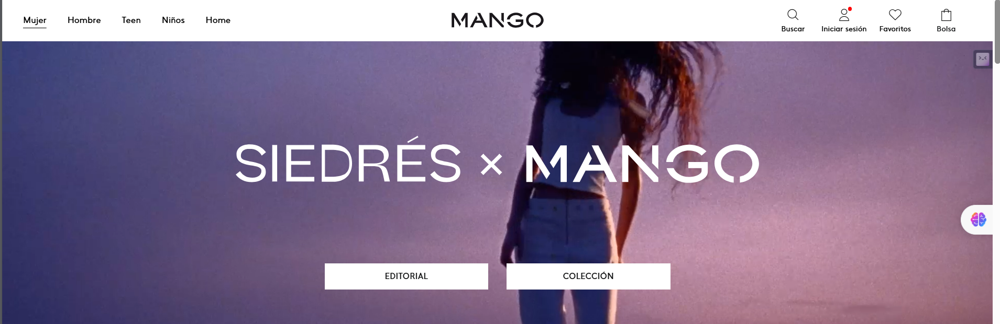

    Como podemos ver el menu consta de la ropa de hombre,mujer además de niño y de Home,muy parecida también a la que tiene Zara,pero yo en este caso solo tengo ropa de hombre y de mujer así ue he preferido usar hombre y mujer y otra para nuestra nueva colección donde aparece toda la ropa,además de yo meterle un toque personal fijandome en una de las páginas que hice hace muchos años donde tenía div completo que cada x segundo se cambiaba la foto:
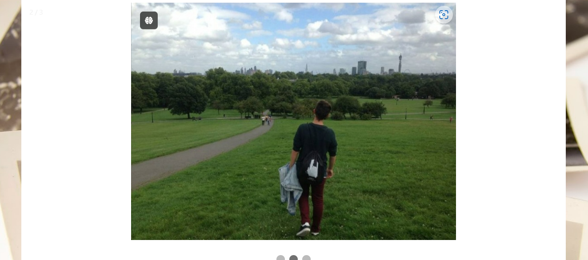

    Y el resultado obtenido de mezclar estas ideas es algo talque así:
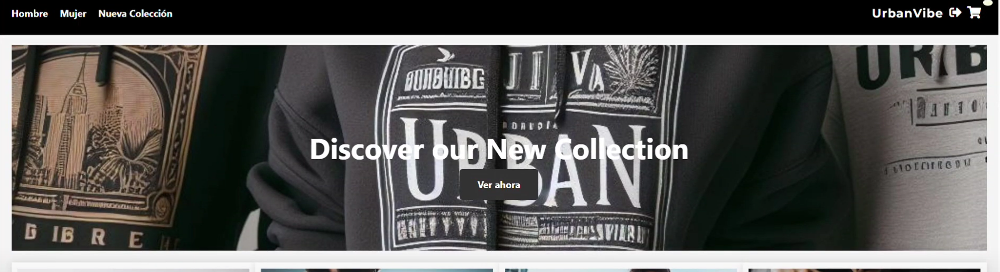

    Por ejemplo para hacer qque cada x segundo se vaya cambiado la foto he usado este código:
    ```javascript
        const heroBanner = document.getElementById('hero-banner');
        const images = [
            '/img/mainimagen.jpeg',
            '/img/mainimagen2.jpeg',
            '/img/mainimagen3.jpeg',
            '/img/streetphoto.jpg',
            '/img/streetphoto2.jpg'
        ];
        let currentImageIndex = 0;
    
        function changeBackgroundImage() {
            currentImageIndex = (currentImageIndex + 1) % images.length;
            heroBanner.style.backgroundImage = `url(${images[currentImageIndex]})`;
        }
    
        setInterval(changeBackgroundImage, 5000);
    ```
    Primeramente añado todas las imagenes que yo deseo que estén en una lista con respectiva ruta,indico que foto va a ser la primera y con el método changeBackgroundImage() y despues de haber recogido el div con el DOM que se llama hero-banner,recorro la lista de uno en uno y le meto un intervalo de 5 segundos.

    La forma de mostrar la ropa también tiene su aquel aunque al final no deja de ser un div de width 100% y que cada div que muestra una prenda ocupe un 25% de ese width y ya luego la altura la deseada, en UrbanVibe se muestran así:
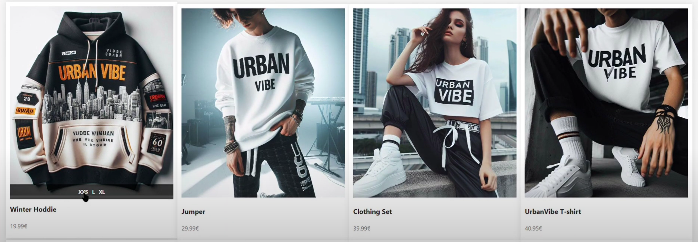
    
    Si nos fijamos en el video que tengo, podemos ver como tiene un hover que en cuanto tu pones el ratón encima del div,aparece las tallas que tiene disponibles,las cuales si tu pulsas en una de las tallas que aparece,automáticamente se añade al carrito en cambio si tu haces click en cualquier otro lugar que no sea donde se encuentran las tallas,se redirige a la siguiente página

    También en este endpoint podemos ver 2 ventanas modales;una de ellas se despliega cuanto hacemos click en el símbolo del carrito,mientras otra de ella se muestra cuando hacemos click en el lápiz,esto indica que vamos a cambiar la talla de la ropa;

    Modal de carrito:
    ```html
    <div class="cart-sidebar" id="cart-sidebar">
        <div class="cart-header">
            <span class="cart-title">Cesta</span>
            <i class="fas fa-times close-cart"></i>
        </div>
        <ul class="cart-items"></ul>
        <button class="checkout-btn" onclick="checkCart()">Purchase Order</button>
    </div>
    ```

    Y con este script abro el carrito manualmente:
    
    ```javascript
        cartIcon.addEventListener('click', () => {
        cartSidebar.classList.add('open');
        /** Renderizar el carrito cuando se abre */
        renderCartItems(); 
        });
    ```
    Además de abrirlo,si tiene articulos el carrito se renderiza las prendas que existan.


    Modal de Edición:
```html
<div class="modal" id="edit-modal">
    <div class="modal-content">
        <div class="cart-header">
            <span class="cart-title">Editar Artículo</span>
            <i class="fas fa-times close-cart" id="close-edit-modal"></i>
        </div>

        <div class="cart-items edit-item-details">
            
                <div class="show-clothes">
                    <form id="editClothesForm">
                        <div class="form-group">
                            <strong>
                                <p id="description" class="form-control-description"></p>
                            </strong>
                        </div>
                        <div class="form-group">
                            <p id="price" class="form-control-price"></p>
                        </div>
                        <div class="form-group">
                            <label for="sizes">Sizes</label>
                            <p id="sizes" class="form-control"></p>
                            <!-- Mostrar todas las tallas aquí -->
                        </div>
                    </form>

                    <div class="edit-buttons">
                        <button id="save-changes-btn" class="buttons-edit-cancel">Guardar cambios</button>
                        <button class="close-modal buttons-edit-cancel" id="close-modal-exit">Cancelar</button>
                    </div>
                </div>
            </div>
        </div>
    </div>
```

El script que abre el modal de edición es el siguiente:
```javascript
        function openEditModal(id) {
            console.log("Opening modal with ID:", id);  
            fetch(`/clothes/edit/${id}`)
                .then(response => {
                    if (!response.ok) {
                        throw new Error("Network response was not ok");
                    }
                    return response.json();
                })
                .then(data => {
                    console.log("Opening modal with data:", data);
        
                    const imageElement = document.getElementById('edit-item-image');
                    const descriptionElement = document.getElementById('description');
                    const sizeElement = document.getElementById('size');
                    const priceElement = document.getElementById('price');
                    const sizesParagraph = document.getElementById('sizes');
        
                    if (imageElement) {
                        imageElement.src = data.image;
                    } else {
                        console.error("Image element not found");
                    }
        
                    if (descriptionElement) {
                        descriptionElement.innerText = data.description;
                    } else {
                        console.error("Description element not found");
                    }
        
                    if (sizeElement) {
                        sizeElement.innerText = data.size;
                    } else {
                        console.error("Size element not found");
                    }
        
                    if (priceElement) {
                        priceElement.innerText = `${data.price}€`;
                    } else {
                        console.error("Price element not found");
                    }
        
                    if (sizesParagraph) {
                        sizesParagraph.innerHTML = '';  
        
                        const availableSizes = data.availableSizes || [];
                        availableSizes.forEach(size => {
                            const sizeSpan = document.createElement('span');
                            sizeSpan.innerText = size;
                            sizeSpan.classList.add('size-option');
                            if (data.size && size === data.size) {
                                sizeSpan.classList.add('selected-size');
                            }
        
                            sizeSpan.addEventListener('click', () => {
                                document.querySelectorAll('.size-option').forEach(span => {
                                    span.classList.remove('selected-size');
                                });
                                sizeSpan.classList.add('selected-size');
                                localStorage.setItem('selectedSize', size);
                                /** Actualiza la talla */
                                data.size = size; 
                            });
        
                            sizesParagraph.appendChild(sizeSpan);
                        });
                    } else {
                        console.error("Sizes paragraph element not found");
                    }
        
                    /** Muestra el modal de edición */
                    document.getElementById('edit-modal').style.display = 'flex';
        
                    /** Maneja el evento de guardar los cambios dentro del modal de edicion */
                    saveChangesBtn.onclick = () => saveChanges(data.id, data.size);

                })
                .catch(error => {
                    console.error("Error fetching data:", error);
                });
        }
    
```
    
Con este código lo que hago es ver a que prenda ha hecho click,comprobar si existen cada uno de sus atributos y una vez comprobados abrimos el modal y ejercemos la lógica de una edición de talla.

Y los estilos que he usado en esta página son los siguientes:
```css
        @import url('https://fonts.googleapis.com/css2?family=Montserrat:wght@700&display=swap');
        body {
            font-family: 'Segoe UI', Tahoma, Geneva, Verdana, sans-serif;
            margin: 0;
            padding: 0;
            background-color: #f5f5f5;
            display: flex;
            flex-direction: column;
            min-height: 100vh;
            overflow-x: hidden;
        }
        .header {
            background-color: #000;
            color: #fff;
            padding: 20px 0;
            width: 100%;
            position: fixed;
            top: 0;
            left: 0;
            z-index: 1000;
            height: 5.5%;
        }
        .navbar {
            display: flex;
            justify-content: space-between;
            align-items: center;
            padding: 0 20px;
        }
        .nav-list {
            cursor: pointer;
            list-style: none;
            padding: 0;
            display: flex;
            align-items: center;
        }
        .nav-list li {
            margin-right: 20px;
        }
        .nav-list li a {
            text-decoration: none;
            color: #fff;
            font-weight: bold;
        }
        .company-name {
            font-family: 'Montserrat', sans-serif;
            font-size: 20px;
            text-align: center;
            margin-right: 10px;
            letter-spacing: 1px;
            color: #fff;
        }
        .navbar-icons {
            display: flex;
            align-items: center;
            position: relative;
        }
        .navbar-icons i {
            font-size: 20px;
            color: #fff;
            margin-right: 10px;
            cursor: pointer;
        }
        /**
        .search-input {
            position: absolute;
            right: 0;
            top: 50%;
            transform: translateY(-50%);
            height: 35px;
            padding: 5px;
            border: none;
            border-radius: 5px;
            width: 0;
            opacity: 0;
            transition: width 0.4s ease, opacity 0.4s ease;
        }
        .search-input.active {
            width: 200px;
            opacity: 1;
        }
        */
        .main-content {
            flex: 1;
            padding: 20px;
            margin-top: 80px;
        }
        .hero-banner {
            background: #000;
            text-align: center;
            color: #fff;
            padding: 100px 0;
            background-size: cover;
            background-position: center;
            position: relative;
            overflow: hidden;
        }
        .hero-title {
            font-size: 48px;
            margin-bottom: 20px;
            position: relative;
            z-index: 2;
        }
        .btn-primary {
            background-color: #333;
            padding: 15px 30px;
            border-radius: 5px;
            text-decoration: none;
            color: #fff;
            font-weight: bold;
            transition: background-color 0.3s ease;
            position: relative;
            z-index: 2;
        }
        .btn-primary:hover {
            background-color: #555;
        }
        .featured-products {
            display: flex;
            flex-wrap: wrap;
            width: 100%;
            padding: 20px 0;
            margin: 0;
        }
        .product-card {
            background-color: #fff;
            box-shadow: 0 0 15px rgba(0, 0, 0, 0.1);
            text-align: left;
            transition: transform 0.3s;
            padding: 10px;
            width: 25%;
            box-sizing: border-box;
            position: relative;
            display: flex;
            flex-direction: column;
            justify-content: space-between;
        }
        .product-card:hover {
            transform: translateY(-5px);
        }
        .product-card:hover .size-container {
            opacity: 1;
        }
        .product-card img {
            width: 100%;
            height: 450px;
            object-fit: cover;
            margin-bottom: 5px;
        }
        .image-container {
            position: relative;
        }
        .size-container {
            display: flex;
            justify-content: center;
            gap: 10px;
            position: absolute;
            bottom: 0;
            left: 0;
            right: 0;
            background-color: rgba(0, 0, 0, 0.7);
            padding: 10px;
            opacity: 0;
            transition: opacity 0.3s ease;
        }
        .sizes {
            color: #fff;
            font-size: 12px;
            font-weight: bold;
            cursor: pointer;
        }
        .product-title {
            font-size: 16px;
            margin-bottom: 5px;
            color: #333;
        }
        .product-price {
            font-size: 14px;
            color: #888;
            margin-bottom: 10px;
        }
        .footer {
            background-color: #000;
            color: #fff;
            text-align: center;
            padding: 20px 0;
            margin-top: auto;
        }
        .footer p {
            margin: 0;
        }
        @media (max-width: 768px) {
            .navbar {
                flex-direction: column;
                align-items: center;
            }
            .company-name {
                margin-bottom: 10px;
            }
            .navbar-icons {
                margin-top: 20px;
            }
            .navbar-icons i {
                margin-right: 8px;
            }
            .product-card {
                width: 100%;
            }
        }
        @media (max-width: 480px) {
            .hero-title {
                font-size: 36px;
            }
            .btn-primary {
                padding: 10px 20px;
            }
        }

        .checkout-btn {
            display: block;
            width: 80%; 
            margin: 0 auto;
            padding: 15px;
            background: #333;
            color: #fff;
            text-align: center;
            border: none;
            border-radius: 5px;
            font-size: 18px;
            font-weight: bold;
            cursor: pointer;
            transition: background 0.3s ease, transform 0.3s ease;
        }        
        .checkout-btn:hover {
            background: #555;
            transform: scale(1.05);
        }
        .marquee-container {
            position: sticky;
            bottom: 0;
            width: 100%;
            background-color: #333;
            color: #fff;
            text-align: center;
            padding: 5px 0;
            z-index: 1000;
            overflow: hidden;
        }
        .marquee {
            display: inline-block;
            white-space: nowrap;
            animation: marquee 10s linear infinite;
        }
        @keyframes marquee {
            0% { transform: translateX(100%); }
            100% { transform: translateX(-100%); }
        }
        .modal-overlay {
            position: fixed;
            top: 0;
            left: 0;
            width: 100%;
            height: 100%;
            background: rgba(0, 0, 0, 0.7);
            display: flex;
            justify-content: center;
            align-items: center;
            z-index: 2000;
        }
        .modal {
            display: none;
            position: fixed;
            top: 0;
            right: 0;
            width: 300px;
            height: 100%;
            background: #fff;
            box-shadow: -2px 0 5px rgba(0, 0, 0, 0.2);
            z-index: 1001;
            transition: right 0.3s ease;
        }
        
        .modal.open {
            display: block;
            opacity: 1;
            transform: translate(-50%, -50%) scale(1);
        }
        
        .modal-content {
            display: flex;
            flex-direction: column;
            height: 100%;
            width: 100%;
            overflow-x: hidden;
        }
        
        .modal-header,
        .modal-footer {
            display: flex;
            justify-content: space-between;
            align-items: center;
            padding: 15px;
            border-bottom: 1px solid #ddd;
        }
        
        .modal-header {
            border-bottom: 1px solid #ddd;
        }
        
        .modal-footer {
            border-top: 1px solid #ddd;
        }
        
        .modal-title {
            font-size: 24px;
            font-weight: bold;
            color: #333;
        }
        
        .close-modal {
            font-size: 24px;
            cursor: pointer;
            color: #888;
        }
        
        .modal-body {
            flex: 1;
            overflow-y: auto;
        }
        
        .modal-form-group {
            margin-bottom: 20px;
        }
        
        .modal-form-group label {
            font-size: 16px;
            font-weight: bold;
            margin-bottom: 5px;
            display: block;
            color: #333;
        }
        
        .modal-form-group input,
        .modal-form-group select {
            width: 100%;
            padding: 10px;
            border: 1px solid #ddd;
            border-radius: 5px;
            font-size: 16px;
        }
        
        .modal-form-group select {
            -webkit-appearance: none;
            -moz-appearance: none;
            appearance: none;
        }
        
        #edit-item-image {
            width: 45%;
            height: auto;
            max-height: 200px;
            object-fit: cover;
            border-radius: 10px;
            margin-right: 10px;
        }
        
        #edit-item-title {
            font-size: 20px;
            font-weight: bold;
            color: #333;
            margin-bottom: 5px;
        }
        
        #edit-item-price {
            font-size: 18px;
            color: #888;
            margin-bottom: 10px;
        }
        
        #save-changes-btn,
        #close-modal-exit {
            background-color: #333;
            color: #fff;
            margin-right: 10px;
            padding: 10px 20px;
            border: none;
            border-radius: 5px;
            font-size: 16px;
            cursor: pointer;
            transition: background-color 0.3s ease;
        }
        
        #save-changes-btn:hover,
        #close-modal-exit:hover {
            background-color: #555;
        }
        
        .cart-sidebar {
            position: fixed;
            top: 0;
            right: -100%;
            width: 300px;
            height: 100%;
            background: #fff;
            box-shadow: -2px 0 5px rgba(0, 0, 0, 0.2);
            transition: right 0.3s ease;
            z-index: 1001;
            display: flex;
            flex-direction: column;
            justify-content: space-between;
        }
        
        .cart-sidebar.open {
            right: 0;
        }
        
        .cart-header {
            display: flex;
            justify-content: space-between;
            align-items: center;
            padding: 15px;
            border-bottom: 1px solid #ddd;
        }
        
        .cart-title {
            font-size: 24px;
            font-weight: bold;
            color: #333;
        }
        
        .close-cart {
            font-size: 24px;
            cursor: pointer;
        }
        
        .cart-items {
            list-style: none;
            padding: 0;
            margin: 0;
            flex: 1;
            overflow-y: auto;
        }
        
        .cart-item {
            display: flex;
            justify-content: space-between;
            margin-bottom: 15px;
            padding: 10px;
            border-bottom: 1px solid #ddd;
        }
        
        .cart-item img {
            width: 80px;
            height: 80px;
            object-fit: cover;
            margin-right: 15px;
        }
        

        .cart-items.edit-item-details{
            overflow-x: hidden;
        }
        
        .cart-item-title {
            font-size: 18px;
            margin: 0 0 5px 0;
            color: #333;
        }
        
        .cart-item-price {
            font-size: 16px;
            color: #888;
        }
        
        .checkout-section {
            padding: 15px;
            border-top: 1px solid #ddd;
        }
        
        .checkout-button {
            display: block;
            width: 70%;
            padding: 10px;
            background-color: #333;
            color: #fff;
            border: none;
            cursor: pointer;
            font-size: 16px;
            transition: background-color 0.3s ease;
            text-align: center;
            text-decoration: none;
        }
        
        .checkout-button:hover {
            background-color: #555;
        }

        .edit-item-image {
            width: 50% !important; /** Ajusta el ancho de la imagen según sea necesario */
            height: auto !important; /** Esto mantendrá la proporción de la imagen */
            max-height: 200px !important; /** Establece una altura máxima para la imagen */
            display: block !important; /** Asegura que la imagen se muestre como un bloque */
            margin: 0 auto !important; /** Esto centra la imagen horizontalmente */
        }
        
        .edit-item-image img {
            width: 50% !important; /** Ajusta el ancho de la imagen según sea necesario */
            height: auto !important; /** Esto mantendrá la proporción de la imagen */
            max-height: 200px !important; /** Establece una altura máxima para la imagen */
            display: block !important; /** Asegura que la imagen se muestre como un bloque */
            margin: 0 auto !important; /** Esto centra la imagen horizontalmente */
        }
        .edit-item-details{
            display: block !important;
            justify-content: start;
            align-items: center;
            margin-top: 20px;/** Esto centra la imagen horizontalmente */

                }

        #edit-item-image{
                    width: 45%;
            height: auto;
            max-height: 200px;
            object-fit: cover;
            border-radius: 10px;
            margin-right: 10px; /** Esto centra la imagen horizontalmente */
                }

        #edit-item-title {
            font-size: 20px;
            font-weight: bold;
            color: #333;
            margin-bottom: 5px;
        }

        #edit-item-price {
            font-size: 18px;
            color: #888;
            margin-bottom: 10px;
        }
        #save-changes-btn, 
        #close-modal-exit {
            background-color: #333;
            color: #fff;
            padding: 10px 20px; /** Asegura el mismo tamaño y relleno */
            border: none;
            border-radius: 5px;
            font-size: 16px;
            cursor: pointer;
            transition: background-color 0.3s ease;
        }

        #save-changes-btn:hover, 
        #close-modal-exit:hover {
            background-color: #555;
        }   
        

        .edith2 {
            font-size: 24px;
            font-weight: bold;
            color: #333;
        }
        .show-clothes{
            display:block;
            margin:10px;
            margin-left:15%;
        }

        .edit-buttons{
            display: flex;
            margin: 0 -2rem;
            align-items:center;


        }

        .buttons-edit-cancel{
            margin: 0.8rem 0.2rem 0.2rem !important;
            
        
        }
        .cart-counter {
            display: none; /** Ocultar el contador por defecto */
            font-family: 'Dancing Script', cursive;
            position: absolute;
            top: -10px;
            right: -10px;
            background-color: rgb(245, 245, 220); /** Color de fondo rojo */
            color: black;
            border-radius: 50%;
            padding: 5px 8px; /** Aumentar el relleno para que sea más visible */
            font-size: 14px; /** Aumentar el tamaño de la fuente */
            font-weight: bold; /** Hacer el texto en negrita */
            box-shadow: 0 2px 5px rgba(0, 0, 0, 0.2); /** Agregar sombra */
        }

        .cart-icon .cart-counter {
            display: inline; /** Mostrar el contador cuando se pasa el ratón sobre el icono */
        }
        .form-control-description{
            font-size: 18px;
            color: #333;
        }
        .form-control-price{
            color:#888;
        }

        .form-control span {
            font-size: 1rem;
            padding: 15px 20px;
            border: 1px solid #ccc;
            border-radius: 100%;
            cursor: pointer;
            transition: all 0.3s;
        }
        
        .form-control .selected-size {
            background-color: black;
            color: white;
            flex-wrap: wrap;

        }

        .urban-contact{
            text-decoration:none;
            color:white;
            cursor: pointer;
        }

```
Estos estilos sirven para darle toda la estética a la página como por ejemplo los modales situados a la derecha de la página con z-index y muy importante el position:fixed para fijar la posición.
Además de darle estilos a mis cardview y mi carrito.

* details.html: esta es una de las páginas encargadas de hacer más visual eh intuitivo los atributos de la ropa,es decir,se muestran de una manera mejor planteada y mas visible y cómoda para el usuario:
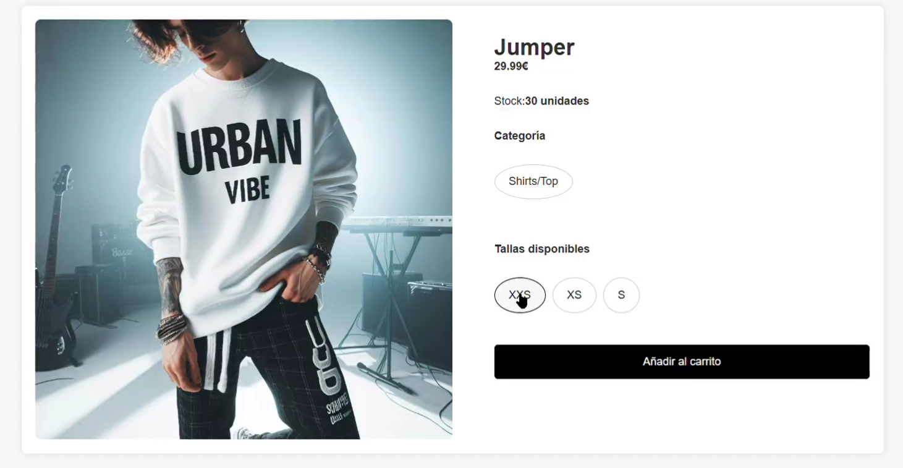

Y como podemos ver muestro el stock,el precio,la imagen,las tallas disponibles y categoría a la que pertenece,si le das a añadir al carrito sin antes haber seleccionado una talla,le aparecerá "Por favor seleccione una talla", de color rojo para que el usuario cliente sepa en todo momento que es lo que está pasando,luego una vez seleccione la talla se añadirá al carrito con la talla que el usuario ha elegido.

Para manejar si el usuario hace click en la talla o en otro lugar he usado el siguiente código:
```javascript
document.addEventListener('DOMContentLoaded', function() {
            document.addEventListener('click', function(event) {
                const target = event.target;
                const isSize = target.classList.contains('sizes');
                
                if (isSize) {
                    const clotheElement = target.closest('.product-card');
                    const clotheId = clotheElement.dataset.id;
                    const size = target.dataset.size;
                    addToCart(clotheId, size);
                } else {
                    const clotheElement = target.closest('.product-card');
                    if (clotheElement) {
                        const clotheId = clotheElement.dataset.id;
                        window.location.href = `clothes/details/${clotheId}`;
                    }
                }
            });
        });
```
Con el DOM recogemos el valor que buscamos,en este caso, la "cardview" en la cúal,si donde hace click el cliente es donde se encuentran las tallas entonces llamo a la función que me añade la ropa al carrito,y si no hace click en este lugar,entonces cojo el id de la ropa en donde haya hecho click y le redirecciono a su respectivo endpoint *"clothes/details/{clothes.id}"*

Y estos son sus respectivos estilos:
```css
        body {
            font-family: 'Arial', sans-serif;
            background-color: #f7f7f7;
            margin: 0;
            padding: 0;
            color: #333;
        }

        .details-container {
            display: flex;
            flex-direction: column;
            align-items: center;
            padding: 20px;
        }

        .details-content {
            display: flex;
            justify-content: space-between;
            width: 100%;
            max-width: 1200px;
            background-color: #fff;
            padding: 20px;
            box-shadow: 0 0 10px rgba(0, 0, 0, 0.1);
            border-radius: 8px;
            margin-top: 5rem;
        }

        .details-left {
            width: 50%;
            display: flex;
            justify-content: center;
            align-items: center;
        }

        .details-image {
            max-width: 100%;
            max-height: 600px;
            object-fit: cover;
            border-radius: 8px;
        }

        .details-right {
            width: 45%;
            display: flex;
            flex-direction: column;
            gap: 10px;
        }

        .details-right h1 {
            font-size: 2rem;
            margin-bottom: 5px;
        }

        .details-right p {
            font-size: 1rem;
            margin-bottom: 5px;
        }

        .details-right ul {
            list-style-type: none;
            padding: 0;
            display: flex;
            gap: 10px;
            flex-wrap: wrap;
            margin-bottom: 5px;
        }

        .details-right ul li {
            font-size: 1rem;
            padding: 15px 20px;
            border: 1px solid #ccc;
            border-radius: 100%;
            cursor: pointer;
            transition: all 0.3s ease;
        }

        .details-right ul li:hover {
            border-color: #000;
            background-color: #f7f7f7;
        }

        .details-right ul li.active {
            border-color: #000;
            background-color: #000;
            color: #fff;
        }

        .details-right button {
            padding: 15px;
            background-color: #000;
            color: #fff;
            border: none;
            cursor: pointer;
            font-size: 1rem;
            border-radius: 5px;
            transition: background-color 0.3s;
        }

        .details-right button:hover {
            background-color: #333;
        }

        .added {
            background-color: green;
            cursor: default;
        }

        .subtitle {
            margin-top: -1rem;
        }

        .error-message {
            color: red;
            margin-bottom: 10px;
            display: none;
        }

```
Estos estilos son muy importantes tanto por el error que le indico al usuario de un color llamativo para que sepa que tiene que añadir la talla como para que la talla se vea atractiva y la ropa que el usuario tiene intención de comprar se vea de una forma clara.

* orders.html: Para hacer esta ventana,creo que ha sido la menos costosa porque siempre he tenido en mente como quería que fuese ya que obviamente el cliente tiene que saberque tiene que hacer en todo momento y sobre todo ver la información de su pedido,
además obviamente como al registrarte,no metes todos los datos neecsarios pues obviamente necesito un formulario que recoja todo lo posible en cuanto al usuario en cuestión,todo esto lo he pensado así para darl dinamismo a la aplicación y que no se hiciera pesada:
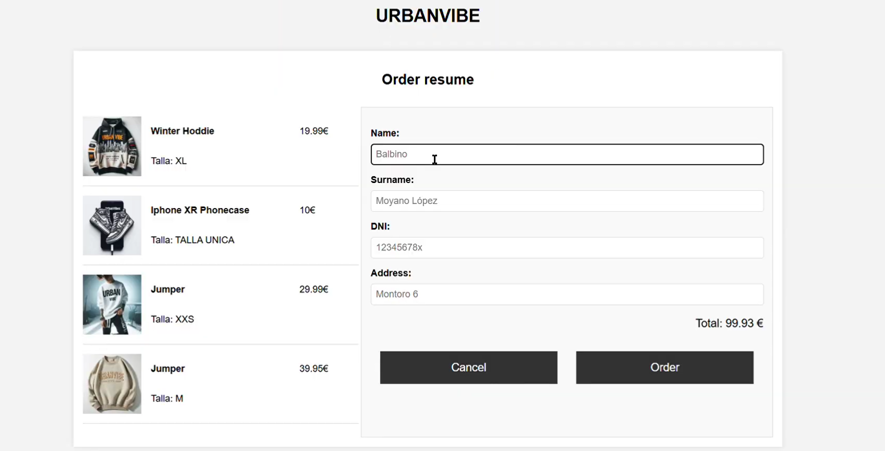

Recojo la ropa de la siguiente manera:
```javascript
cartData.forEach((item) => {
                    if (!item.id || isNaN(item.id)) {
                        console.error("Invalid item in cart:", item);
                        return;
                    }
    
                    const itemElement = document.createElement("div");
                    itemElement.classList.add("order-item");
    
                    itemElement.innerHTML = `
                        
                        <div class="details-clothes">
                            <b><p>${item.description}</p></b>
                            <p>Talla: ${item.size}</p>
                        </div>
                        <div class="details-price"> 
                            <p>${item.price}€</p>
                        </div>
                    `;
    
                    orderItemsContainer.appendChild(itemElement);
                    totalPrice += parseFloat(item.price);
                });
```
Aquí recojo los datos ue tengo almacenados del carrito del usuario y los muestro en pantalla de la misma manera y con los mismos estilos con la que muestro la ropa cuando se encuentra en el carrito.
Y ya una vez recogida la ropa con el formulario que tengo **ACTUALIZO** al usuario con ese mismo id y creo **UNA LINEA PEDIDO**, esto es muy importante porque no hayq ue confundir,necesitamos la linea pedido para ver que pedidos hay y dentro de estos pedido que ropa se han llevado por esta razón es tan importante que creemos una linea pedido y no un pedido.

Y una vez se ha creado y hemos terminado la compra se nos redirigirá al siguiente endpoint "/thnku"

* thnku.html:
En este endpoint únicamente me sirve para dar las gracias al usuario por su compra y a mime hace saber que si ha llegado a este endpoint también le ha llegado su respectivo correo indicando que la compra fue un éxito:


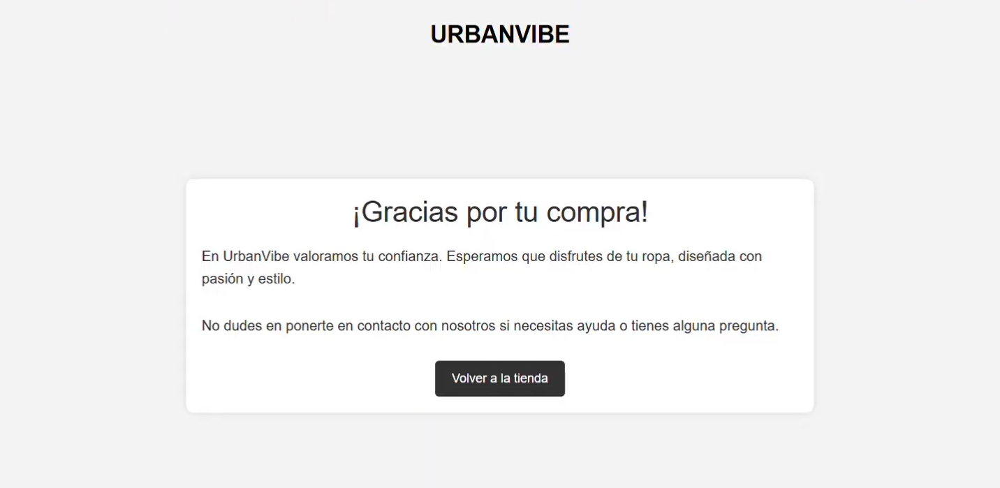

Y aquí está el correo verificando la compra:
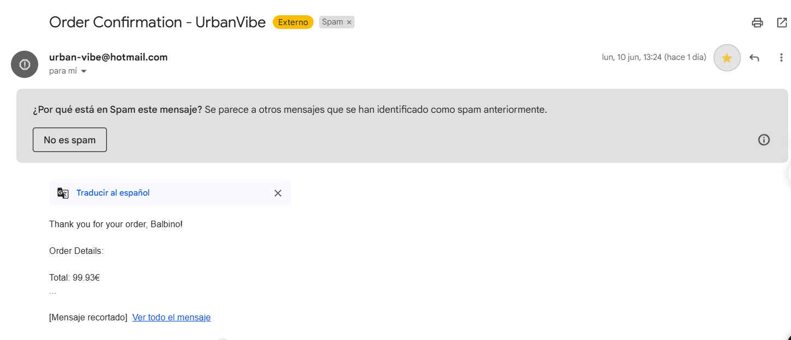

Otro efecto chulo que tengo al iniciar sesión con rol de Admin o al cerrar sesión sería el siguiente:
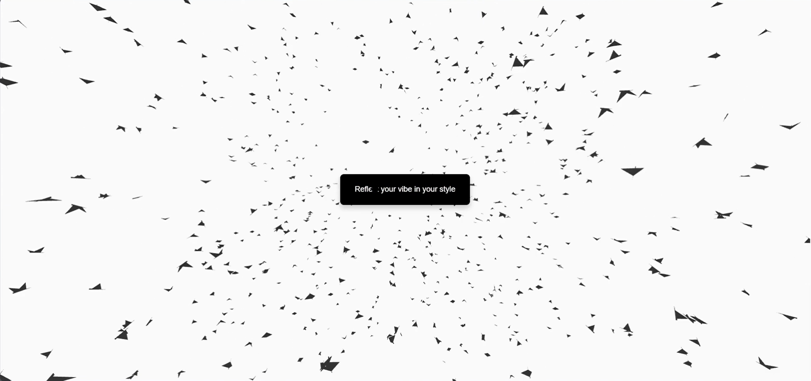
El cúal está hecho en su mayoría con la documentación que tiene vanta en su propia web,ya yo únicamente le he dado los estilos que a mi me gustan y más concuerdan con la página.

Y así podemos nosotros hacer nuestro propio efecto:
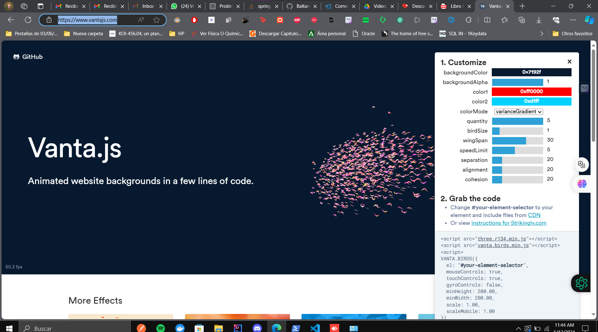
Y de manera dinámica podemos ver como como se va cambiando el fondo y los "pájaros" segun los estilos que le apliquemos en la parte del menú lateral derecho.

* login.html:
```html
<html lang="en">
    <head>
        <meta charset="UTF-8">
        <meta name="viewport" content="width=device-width, initial-scale=1.0">
        <title>UrbanVibe - Log in</title>
        <link rel="icon" href="img/UrbanVibeICON.ico" type="image/x-icon">
        <link rel="shortcut icon" href="img/UrbanVibeICON.ico" type="image/x-icon">
    </head>
    <body>
        <div class="container">
            <div>

                <h1>UrbanVibe</h1>
                <br>
            </div>

            <form action="/login" method="POST">
                <div class="form-group">
                    <label for="username" class="form-label">Username:</label>
                    <input
                        name="username"
                        id="username"
                        class="form-control"
                        type="text"
                        placeholder="user215"
                        required="required">
                </div>
                <div class="form-group">
                    <label for="password" class="form-label">Password:</label>
                    <input
                        name="password"
                        type="password"
                        id="password"
                        placeholder="******"
                        class="form-control"
                        required="required">
                </div>
                <div class="form-check">
                    <input class="form-check-input" type="checkbox" id="rememberMe">
                    <label class="form-check-label" for="rememberMe">Recordar sesión</label>
                </div>
                <div class="error-message" th:if="${param.error}">
                    Usuario y/o contraseña incorrectos
                </div>
                <a href="/users/signup" class="forgot-password">Don't you have an account yet? Sign up!</a>
                <button type="submit" class="btn btn-primary">Sign in</button>
            </form>
        </div>
    </body>
</html>
```
Como podemos ver yo no uso un botón que me lleve al registro sino que uso una etiqueta "a" que me parece más cómodo para la experiencia del usuario. y luego en cuanto al registro:


* register.html:
```html
<!DOCTYPE html>
<html lang="en">
<head>
    <meta charset="UTF-8">
    <meta name="viewport" content="width=device-width, initial-scale=1.0">
    <title>UrbanVibe - Sign up</title>
    <link rel="icon" href="img/UrbanVibeICON.ico" type="image/x-icon">
    <link rel="shortcut icon" href="img/UrbanVibeICON.ico" type="image/x-icon">
</head>
<body>
    <div class="container">
        <div>
            <h1>UrbanVibe</h1>
            <br>
        </div>

        <form th:action="@{/users/signup}" th:object="${user}" method="POST">
            <div class="form-group">
                <label for="mail" class="form-label">Mail:</label>
                <input name="mail" type="email" id="mail" class="form-control" placeholder="example@example.es" th:field="*{mail}" required>
            </div>
            <div class="form-group">
                <label for="username" class="form-label">Username:</label>
                <input name="username" id="username" class="form-control" type="text" placeholder="user215" th:field="*{username}" required>
            </div>
            <div class="form-group">
                <label for="password" class="form-label">Password:</label>
                <input name="password" type="password" id="password" placeholder="******" class="form-control" required>
                <br/>
                <div th:if="${#fields.hasErrors('mail')}" th:errors="*{mail}" class="error"></div>
                <div th:if="${#fields.hasErrors('username')}" th:errors="*{username}" class="error"></div>


            </div>
            
            <div class="button-container">
                <button type="submit" class="btn btn-primary">Register</button>
                <button type="submit" class="btn btn-primary" onclick="window.location.href='/login'">Cancel</button>
            </div>
        </form>
    </div>
</body>
</html>
```

Y este es el registro y los estilos que he usado tanto en el registro como para el login son los siguientes:
```css
        body {
            font-family: Arial, sans-serif;
            background-color: #f0f0f0;
            color: #333;
            display: flex;
            justify-content: center;
            align-items: center;
            height: 100vh;
            margin: 0;
            padding: 0;
            background-image: url('/img/Default_A_skyscraper_in_new_yorkalso_i_want_the_statue_of_libe_0.jpg');
            background-size: cover;
        }

        .container {
            width: 100%;
            max-width: 350px;
            padding: 50px;
            background-color: white;
            border-radius: 10px;
            box-shadow: 0px 4px 10px rgba(0,0,0,0.1);
            text-align: center;
        }

        h1 {
            color: black;
            margin-bottom: 10px;
            margin-top: 10px;
        }

        input.form-control {
            width: 100%;
            padding: 12px;
            margin-bottom: 20px;
            border: 1px solid black;
            border-radius: 5px;
            box-sizing: border-box;
            font-size: 16px;
        }

        label.form-label {
            color: black;
            font-weight: bold;
            display: flex;
            margin-bottom: 8px;
            text-align: left;
        }

        .button-container {
            display: flex;
            justify-content: space-between;
            margin-top: 20px; 
        }

        .button-container button {
            flex: 1; 
            margin-right: 10px;
        }

        button.btn-primary {
            background-color: black;
            border: none;
            color: white;
            padding: 14px;
            border-radius: 5px;
            cursor: pointer;
            transition: background-color 0.3s ease;
            font-size: 16px;
        }

        button.btn-primary:hover {
            background-color: black;
        }

        .error {
            color: red;
            font-size: 12px;
            margin-bottom: 10px;
        }
```
Con estos estilos como podemos ver ajusto una imagen de fondo(Nueva York),con la intención de simular el lugar de venta principal de la tienda de ropa,además de por ejemplo mostrar los errores con color y de una forma muy visible como es el color rojo,he usado el flex:1 para que ambos botones contengan el mismo ancho para el registro y algunos botones con sombra y sus respectivos hover.


\pagebreak


